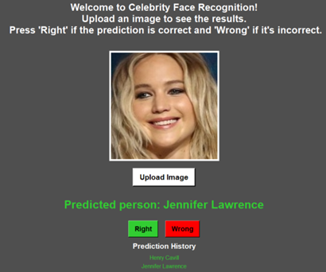

# Celebrity Face Recognition System

Welcome to the **Celebrity Face Recognition System** project! This system is designed to identify celebrity faces in images using a combination of traditional and deep learning techniques. The implementation leverages the speed of Haar Cascade for face detection and the accuracy of MobileNetV2 for face recognition. The project is fully created by Karol Fryc.

## How to Run

1. Open the Jupyter notebook file `UI.ipynb` in Visual Studio Code.
2. Download and install all the necessary libraries listed below.
3. Press "Run All" to execute the notebook.
4. Upload a picture to get the celebrity face recognition results.

## Necessary Libraries

- `tkinter`
- `PyTorch`
- `OpenCV-python`
- `PILLOW`
- `scikit-learn`

## Features

### Face Detection
- **Haar Cascade Classifier**: Used for real-time face detection due to its efficiency and speed.

### Face Recognition
- **MobileNetV2**: A lightweight convolutional neural network for feature extraction and classification.

### User Interface
- **Tkinter**: Provides a simple and user-friendly interface for uploading images and displaying results.
  - **Image Upload Button**: Allows users to upload an image.
  - **Prediction Display**: Shows the predicted identity of the person in the uploaded image.
  - **Feedback Buttons**: Users can indicate whether the prediction was correct or incorrect.

### Data Preparation
- **Dataset**: Utilizes a subset of the “Pins Face Recognition” dataset from Kaggle.
  - **Manual Sorting**: Removes low-quality images for better results.
  - **Data Augmentation**: Applies transformations like rotations, scaling, and flipping to improve robustness.
  - **Preprocessing**: Converts images to grayscale, resizes to 224x224 pixels, and normalizes pixel values.

## Methodology

### Haar Cascade Classifier
- **Initial Detection**: Quickly identifies and isolates face regions within the input images.
- **Low Computational Load**: Ensures the recognition model focuses on relevant parts of the image.

### MobileNetV2
- **Feature Extraction**: Utilizes pre-trained weights from ImageNet for effective feature representation.
- **Efficient Architecture**: Combines depthwise separable convolutions, linear bottlenecks, and inverted residuals.

### Implementation Details
- **Face Detection**: The system detects faces using the Haar Cascade classifier and processes the images to extract facial features.
- **Image Preprocessing**: Crops, resizes, and normalizes detected face images to match the input requirements of MobileNetV2.
- **Face Recognition**: The preprocessed face image is classified using the MobileNetV2 model.

### Experimental Settings
- **Learning Rate**: 0.001
- **Batch Size**: 32
- **Epochs**: 10
- **Optimizer**: Adam

## Evaluation

The system achieved a test accuracy of 83% after 10 epochs, demonstrating strong performance in identifying individuals from images. Integration testing and black-box testing ensured the robustness and practical applicability of the system.

## Future Work

- **Enhance Robustness**: Incorporate advanced data augmentation techniques to handle various real-world conditions.
- **Handle Occlusions**: Integrate models capable of recognizing partially obscured faces.
- **Expand Dataset**: Include a broader range of individuals and facial variations to improve generalization.

## Conclusion

The Celebrity Face Recognition System combines the speed of traditional methods with the accuracy of modern AI techniques, providing a robust and efficient solution for real-time face recognition. Explore the system, contribute, or use it as a foundation for your own projects. Happy coding!
